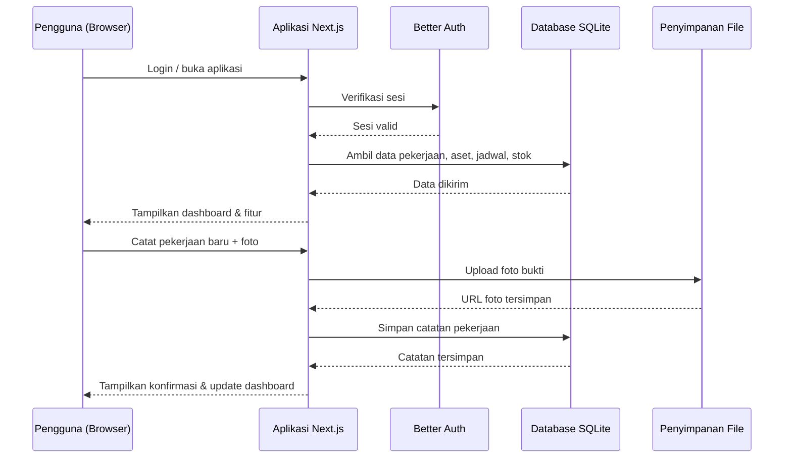
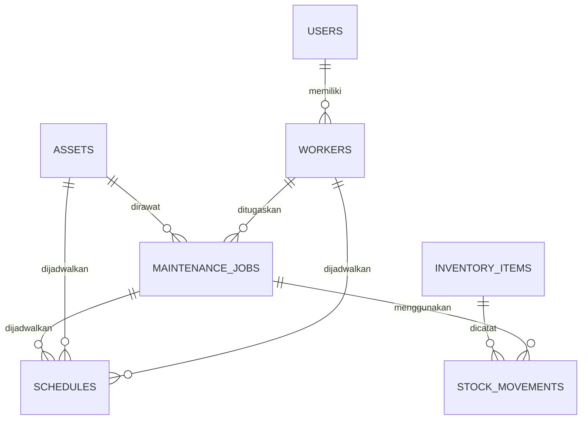

# PRD — Project Requirements Document

## 1. Overview

Aplikasi ini dibuat untuk membantu tim maintenance dalam memantau seluruh pekerjaan perawatan secara **rapi dan terpusat**. Saat ini pencatatan pekerjaan sering dilakukan secara manual sehingga memakan banyak waktu dan berisiko membuat data tidak lengkap atau tidak konsisten.

Tujuan utama aplikasi adalah menjadi pusat kendali pekerjaan maintenance yang mencakup:

- **Dashboard** untuk melihat ringkasan dan tugas hari ini.
- **Penjadwalan** untuk merencanakan perawatan dengan kalender.
- **Registrasi aset** agar setiap pekerjaan terhubung dengan aset yang dirawat.
- **Warehouse** untuk memantau stok suku cadang dan bahan.
- **Daftar pekerja** untuk mengatur pembagian tugas.
- **Panduan pekerjaan** sebagai referensi langkah kerja.

Dengan aplikasi ini, pengguna cukup mencatat satu pekerjaan dengan cepat, lalu semua data tersimpan rapi dan langsung terlihat di dashboard serta kalender.

---

## 2. Requirements

Persyaratan utama proyek adalah:

1. Pengguna dapat melihat ringkasan pekerjaan maintenance dan tugas yang harus dikerjakan hari ini dari halaman beranda.
2. Pengguna dapat mencatat pekerjaan maintenance baru dengan detail seperti judul, deskripsi, jenis perawatan, aset terkait, prioritas, tenggat waktu, dan foto bukti.
3. Pengguna dapat membuat, melihat, mengubah, dan menunda jadwal maintenance melalui tampilan kalender bulanan maupun mingguan.
4. Pengguna dapat mendaftarkan aset, melihat detail aset, dan mengetahui status aset.
5. Pengguna dapat memantau stok gudang, mencatat barang masuk dan keluar, serta mendapat peringatan saat stok minim.
6. Pengguna dapat mengelola data pekerja, mengatur peran, dan melihat beban kerja masing-masing pekerja.
7. Pengguna dapat membaca panduan pekerjaan dan mencari panduan berdasarkan kata kunci.
8. Data harus tersimpan terpusat dan mudah dicari agar tidak ada lagi pencatatan manual yang tersebar.

---

## 3. Core Features

### Fase 1
- **Beranda** [high] — Pusat kendali yang menampilkan ringkasan dan tugas maintenance hari ini.
  - **Ringkasan status** — Menampilkan jumlah pekerjaan selesai, berjalan, dan tertunda.
  - **Tugas hari ini** — Menampilkan daftar pekerjaan yang harus dikerjakan hari ini.
  - **Catat cepat** — Tombol untuk langsung mencatat pekerjaan maintenance baru tanpa membuka menu lain.

### Fase 2
- **Pencatatan Pekerjaan** [high] — Formulir untuk mencatat detail pekerjaan maintenance secara rapi.
  - **Isi detail pekerjaan** — Menambahkan judul, deskripsi, dan jenis perawatan.
  - **Pilih aset terkait** — Menghubungkan pekerjaan dengan aset yang dirawat.
  - **Atur prioritas & tenggat** — Menentukan tingkat prioritas dan batas waktu penyelesaian.
  - **Lampirkan foto** — Mengambil atau mengunggah foto kondisi aset sebagai bukti.
- **Penjadwalan** [medium] — Kalender untuk merencanakan dan melihat jadwal maintenance.
  - **Tampilan kalender** — Melihat jadwal perawatan dalam tampilan bulan atau minggu.
  - **Buat jadwal** — Menambahkan jadwal baru dengan memilih tanggal dan pekerja.
  - **Ubah jadwal** — Mengubah atau menunda jadwal perawatan yang sudah dibuat.
  - **Pengingat jadwal** — Memberi notifikasi sebelum jadwal maintenance tiba.
- **Daftar Aset** [medium] — Mengelola data aset yang menjadi objek maintenance.
  - **Tambah aset** — Mendaftarkan aset baru seperti mesin atau gedung.
  - **Detail aset** — Melihat spesifikasi dan riwayat perawatan aset.
  - **Status aset** — Menandai kondisi aset seperti baik, rusak, atau dalam perbaikan.

### Fase 3
- **Stok Gudang** [medium] — Memantau ketersediaan suku cadang dan bahan di gudang.
  - **Lihat stok** — Menampilkan jumlah suku cadang dan bahan yang tersedia.
  - **Barang masuk** — Mencatat penambahan stok dari pembelian atau pengiriman.
  - **Barang keluar** — Mencatat pengurangan stok saat suku cadang digunakan.
  - **Peringatan stok minim** — Memberi tahu saat stok hampir habis.
- **Daftar Pekerja** [medium] — Mengelola data pekerja maintenance dan pembagian tugas.
  - **Tambah pekerja** — Mendaftarkan pekerja baru dengan informasi keahlian.
  - **Atur peran** — Menentukan tanggung jawab atau area kerja tiap pekerja.
  - **Lihat beban kerja** — Menampilkan jumlah tugas yang sedang ditangani pekerja.

### Fase 4
- **Panduan Pekerjaan** [low] — Kumpulan prosedur dan langkah pengerjaan maintenance.
  - **Daftar panduan** — Menampilkan semua panduan yang tersedia.
  - **Detail prosedur** — Membaca langkah-langkah pengerjaan dengan jelas.
  - **Cari panduan** — Mencari panduan berdasarkan kata kunci.

---

## 4. User Flow

### Alur utama: Mencatat pekerjaan maintenance

1. Pengguna membuka aplikasi dan login.
2. Pengguna melihat **Beranda** yang berisi ringkasan status pekerjaan dan daftar tugas hari ini.
3. Pengguna menekan tombol **Catat cepat**.
4. Pengguna mengisi formulir pekerjaan:
   - Menulis judul dan deskripsi pekerjaan.
   - Memilih jenis perawatan.
   - Memilih aset yang akan dirawat.
   - Menentukan prioritas dan tenggat waktu.
   - Mengambil atau mengunggah foto kondisi aset.
5. Pengguna menyimpan formulir.
6. Sistem menyimpan data pekerjaan, lalu pekerjaan langsung muncul di **Tugas hari ini**, **Kalender**, dan **Riwayat aset**.

### Alur penjadwalan

1. Pengguna membuka menu **Penjadwalan**.
2. Pengguna melihat kalender bulanan atau mingguan.
3. Pengguna membuat jadwal baru dengan memilih tanggal dan pekerja.
4. Pengguna dapat mengubah atau menunda jadwal jika perlu.
5. Sistem mengirimkan pengingat sebelum jadwal tiba.

### Alur pengelolaan aset

1. Pengguna membuka menu **Daftar Aset**.
2. Pengguna menambahkan aset baru atau memilih aset yang sudah ada.
3. Pengguna melihat detail aset, termasuk status dan riwayat perawatan.
4. Pengguna dapat mengubah status aset menjadi baik, rusak, atau dalam perbaikan.

### Alur pemantauan stok gudang

1. Pengguna membuka menu **Stok Gudang**.
2. Pengguna melihat jumlah stok yang tersedia.
3. Pengguna mencatat barang masuk saat ada pembelian/pengiriman.
4. Pengguna mencatat barang keluar saat suku cadang digunakan.
5. Sistem menampilkan peringatan jika stok sudah di bawah batas minimum.

### Alur pengelolaan pekerja

1. Pengguna membuka menu **Daftar Pekerja**.
2. Pengguna menambahkan pekerja baru beserta keahlian dan perannya.
3. Pengguna melihat beban kerja tiap pekerja dari jumlah tugas yang sedang ditangani.

### Alur penggunaan panduan

1. Pengguna membuka menu **Panduan Pekerjaan**.
2. Pengguna melihat daftar semua panduan.
3. Pengguna mencari panduan dengan kata kunci.
4. Pengguna membuka detail prosedur dan mengikuti langkah pengerjaan.

---

## 5. Architecture

Aplikasi ini menggunakan arsitektur **full-stack** sederhana: satu aplikasi Next.js yang menangani tampilan, logika, dan penyimpanan data. Pengguna berinteraksi melalui browser, lalu aplikasi terhubung ke database dan penyimpanan file.

Arsitektur ini bekerja dengan alur sebagai berikut:

- **Frontend (Next.js + Tailwind CSS + shadcn/ui)** — Menampilkan antarmuka dashboard, formulir, kalender, dan halaman lainnya.
- **Backend (API Routes / Server Actions)** — Menangani logika bisnis seperti menyimpan data, validasi, dan perhitungan beban kerja.
- **Autentikasi (Better Auth)** — Mengelola login, sesi pengguna, dan hak akses.
- **Database (SQLite + Drizzle ORM)** — Menyimpan data pekerjaan, aset, jadwal, stok, pekerja, dan panduan.
- **Penyimpanan file** — Menyimpan foto bukti pekerjaan agar bisa diakses kembali.
- **Pengingat jadwal** — Menggunakan penjadwalan otomatis di server untuk mengirim notifikasi sebelum jadwal maintenance tiba.

---

## 6. Database Schema

Berikut tabel utama yang dibutuhkan aplikasi:

| Tabel | Kolom Kunci | Tipe | Kegunaan |
|---|---|---|---|
| **users** | `id`, `name`, `email`, `role`, `created_at` | text, text, text, text, date | Data pengguna yang login. Tabel autentikasi tambahan dikelola oleh Better Auth. |
| **assets** | `id`, `name`, `code`, `location`, `status`, `specs`, `created_at` | text, text, text, text, text, text, date | Data aset seperti mesin atau gedung. |
| **maintenance_jobs** | `id`, `title`, `description`, `maintenance_type`, `asset_id`, `worker_id`, `priority`, `due_date`, `status`, `photo_url`, `created_at` | text, text, text, text, FK, FK, text, date, text, text, date | Catatan pekerjaan maintenance, termasuk prioritas, tenggat, dan foto bukti. |
| **schedules** | `id`, `job_id`, `worker_id`, `asset_id`, `scheduled_date`, `status`, `notes` | text, FK, FK, FK, date, text, text | Jadwal perawatan yang tampil di kalender. |
| **inventory_items** | `id`, `name`, `sku`, `quantity`, `unit`, `min_stock` | text, text, text, number, text, number | Data suku cadang dan bahan di gudang. |
| **stock_movements** | `id`, `item_id`, `type`, `quantity`, `date`, `notes`, `job_id` | text, FK, text, number, date, text, FK | Catatan barang masuk dan barang keluar. |
| **workers** | `id`, `user_id`, `name`, `skill`, `role`, `area` | text, FK, text, text, text, text | Data pekerja maintenance dan keahliannya. |
| **guides** | `id`, `title`, `category`, `steps`, `content` | text, text, text, text, text | Panduan prosedur pengerjaan maintenance. |

### Hubungan antar tabel

---

## 7. Tech Stack

Rekomendasi teknologi untuk aplikasi ini:

- **Frontend:** Next.js dengan Tailwind CSS dan shadcn/ui untuk tampilan yang rapi, cepat, dan konsisten.
- **Backend:** Next.js API Routes / Server Actions sebagai backend sekaligus frontend, sehingga satu aplikasi menangani semua kebutuhan.
- **Database:** SQLite dengan Drizzle ORM untuk penyimpanan data yang ringan dan mudah dikelola.
- **Autentikasi:** Better Auth untuk mengelola login dan sesi pengguna.
- **Penyimpanan file:** Vercel Blob untuk menyimpan foto bukti pekerjaan.
- **Deployment:** Vercel sebagai platform hosting dan proses deploy otomatis.
- **Pengingat jadwal:** Memanfaatkan cron job di Vercel dan layanan email sederhana (misalnya Resend) untuk mengirim notifikasi sebelum jadwal maintenance tiba.